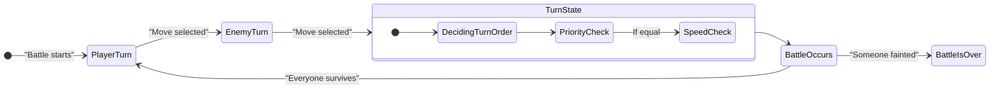

# Pokémon Battle Simulator

A quick and passionate project about a battle simulation against a legendary pokemon trainer.
You play as Jimmy who has caugt a level 1 Rattata. Now face to face against the almighty legendary pokemon trainer.
Can you make sure Jimmy wins?

A C++ battle system implementing the several Programming patterns, while delivering the true OOP.

# 🎯 Overview 
- State Pattern for turn management
- Modern C++ features (smart pointers, move semantics)
- Pimpl Idiom for implementation hiding
- Polymorphic Move System for dynamic battle effects

# 🏗️ Architecture
Core Components

Component |	Purpose |	Key Features
----------|---------|-----------------
Battle	   | Manages battle | flow	State transitions, player/enemy access
BattleState (Base)	| Interface for all states	| Enter(), Execute(), HandleInput(), Exit()
PlayerTurnState	| Handles player moves	| Move selection UI, damage calculation
EnemyTurnState	| AI-controlled | turns	Random move selection, state transition
TurnState | Determine which Pokemon to take a turn | Takes into consideration if a move had a effect before combat
BattleOverState	| End-game handling	| Win/loss detection, battle summary

# Key Design Patterns

🔹 State Pattern
- Encapsulates each battle phase (player turn, enemy turn, etc.)
- Clean separation of turn logic
- Easy to extend with new states (e.g., ItemUseState)

🔹 Strategy Pattern (Moves)
- MoveBase polymorphic interface
- Concrete moves (Thunderbolt, Psychic) override ApplyEffect()

🔹 Pimpl Idiom
- Hides Pokémon implementation details
- Reduces compilation dependencies

# Customizing the move set for each individual Pokemon!
https://github.com/Wait2Late/Pokemon/blob/b247eb06fcedd255ec736f1f0e0e02545ea8f7c8/Main.cpp#L24-L42
https://github.com/Wait2Late/Pokemon/blob/b247eb06fcedd255ec736f1f0e0e02545ea8f7c8/Main.cpp#L50-L51

# Sorts the turn order if a Pokemon has priority then speed checks

https://github.com/Wait2Late/Pokemon/blob/b247eb06fcedd255ec736f1f0e0e02545ea8f7c8/State/TurnState.cpp#L21-L46

# Customizable pokemon moves
**Context:** QuickAttack is a move that priorities to begin first in the turn order, regardless of speed. Endeavor is a move that forces the opponent's health to be the same as the user.  
https://github.com/Wait2Late/Pokemon/blob/b247eb06fcedd255ec736f1f0e0e02545ea8f7c8/Move/QuickAttack.h#L10-L18

https://github.com/Wait2Late/Pokemon/blob/b247eb06fcedd255ec736f1f0e0e02545ea8f7c8/Move/Endeavor.h#L14-L27
